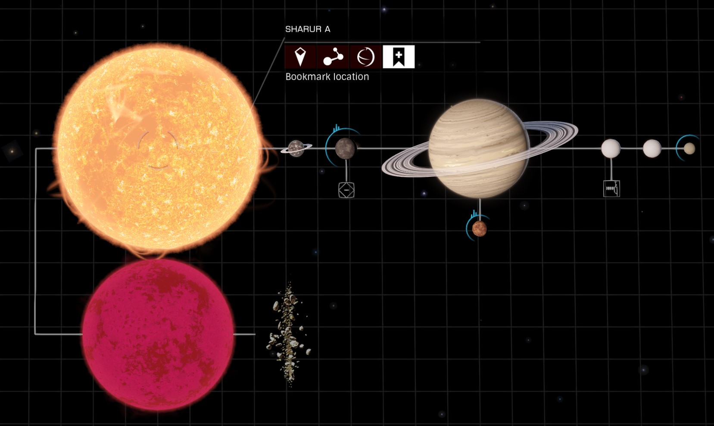

# Elite: Dangerous Universal Cartographics History

As an explorer, I often find it's sad that we can't have a list of all the
star systems and the bodies we discovered or mapped before. I have been
thinking of writing a script like this for quite a long time. Unfortunately, I
couldn't find a way to know whether the bodies had been discovered before.

[Thanks to user `aggasalk` on reddit for the hint!](https://www.reddit.com/r/EliteDangerous/comments/mq50zf/daily_qa_ask_and_answer_any_questions_you_have/guf3tkt?utm_source=share&utm_medium=web2x&context=3)
I can finally finish this script.

The script should be fully functional, though many things can be improved quite
a lot.

## How to use

Make sure you have [Python 3](https://www.python.org/downloads/) installed on
your Windows. Alternatively, type `python3` in `cmd` or `PowerShell` to install
a copy via Microsoft Store. Any version of Python 3 should work. No 3rd party
package required.

Download the script [here](https://raw.githubusercontent.com/tautomer/UniversalCartographicsHistory/master/uchistory/uchistory.py)
and save it to your computer. Double click or run the script in CLI.

Note: if your Python isn't the Microsoft Store version, typing `python3` or
`python3.exe` will only lead you to the Store. Make sure type `python` or
`python.exe` instead.

Some config options are provided via CLI:

```text
Usage:
  python.exe uchistory.py [OPTION...]

Help Option:
  -h, --help              Show this message

E:D Log Path:
  -l, --log-path=         Path to the E:D log files
                          Defaults to C:\Users\username\Saved Games\Frontier Developments\Elite Dangerous

Output File:
  -o, --output=           Output filename and path to save the scan results
                          Defaults to Universal Cartographics Histroy Scan.txt in the current folder

Output Level:
  -v, --verbose=          Output verbose level
                          Level 1 lists only the number of bodies discovered/mapped in the system
                          Level 2 lists the body names as well
                          Defaults to 2
```

Example output

```text
Commander Name: Qualcomm
Total number of First Discovery + First Mapped: 239
Total number of First Discovery: 9632
Total number of First Mapped: 119

System Name: Sharur
  First Discovery:
    Sharur B
    Sharur B A Belt Cluster 1
    Sharur B A Belt Cluster 4
    Sharur A

System Name: Col 285 Sector ZZ-Y d57
  First Mapped:
    Col 285 Sector ZZ-Y d57 4

System Name: Praea Euq UQ-X b1-6
  First Mapped:
    Praea Euq UQ-X b1-6 A 1
    Praea Euq UQ-X b1-6 A 2
    Praea Euq UQ-X b1-6 A 3
    Praea Euq UQ-X b1-6 A 4
    Praea Euq UQ-X b1-6 A 5
    Praea Euq UQ-X b1-6 A 6
    Praea Euq UQ-X b1-6 B 8
    Praea Euq UQ-X b1-6 B 6
    Praea Euq UQ-X b1-6 B 5
    Praea Euq UQ-X b1-6 B 1
    Praea Euq UQ-X b1-6 B 2
    Praea Euq UQ-X b1-6 B 3
    Praea Euq UQ-X b1-6 B 3 a
    Praea Euq UQ-X b1-6 B 4
    Praea Euq UQ-X b1-6 B 7
```

## How it works

Well, basically finding events like `FSDJump`, `Scan`, `SAAScanComplete` in all
the journal files. Currently the path to the log files are assumed to be the
default path, i.e., `C:\Users\username\Saved Games\Frontier Developments\Elite Dangerous`.
An summary called `Universal Cartographics Histroy Scan.txt` will be saved in
the same folder as the script.

## Known issues

* Body names aren't well sorted.

* There some well-known systems (the ones with a unique name, not something like
  `Col balabala`) where the bodies are shown as undiscovered, or say not
  discovered by any one.

  For example, the first ever system I ever "honked", `Sharur` in the starting
  space.

  

  In the journal, these bodies are shown as

  ```text
  { "timestamp":"2020-11-25T21:44:23Z", "event":"Scan", "ScanType":"NavBeaconDetail", "BodyName":"Sharur B A Belt Cluster 4", "BodyID":16, "Parents":[ {"Ring":12}, {"Star":2}, {"Null":0} ], "StarSystem":"Sharur", "SystemAddress":1733187048154, "DistanceFromArrivalLS":41381.868618, "WasDiscovered":false, "WasMapped":false }
  ```

  No one discovered these bodies and the stars and belt clusters are not
  mappable, which means I can't distinguish whether they are first discovered
  by you or not.

  On the other hand, the planets in these systems are mappable, so for any
  bodies with status of `"WasDiscovered":false` and `"WasMapped":true` are
  completely ignored.

  If you happen to be the one who actually mapped these bodies... I'm sorry.

## TODO List

* A simple GUI probably?

* Sort bodies in a system before printing?

## Find a bug?

Report it to me over GitHub. It will be great if you can attach some ED logs so
that it can be easier for me to look into the problem.

Disclaimer: I'm very busy IRL recently so that I can't guarantee a fix for the
issue you might have, but I'll try my best.
